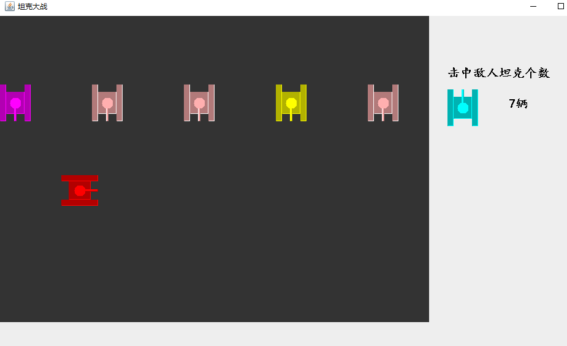

# tank
使用Java GUI 编写一个简单坦克大战

默认



# 第一次提交

**还未实现功能，如果后续有时间会添加上**
- 界面方式操作 如果启动之后是接着上次继续还是重新开始等
- 由于开启了多线程，子弹、坦克等，开启了之后发现如果实现坦克之间不能碰撞
  会非常卡顿
- 目前为了体验关闭了敌人坦克能够发射子弹，如果需要开启可以自己取消该部分注释代码
  ，**不过非常目前这个bug还未处理，应该是坦克消亡之后线程还存在，后面会使用线程组管理**
  ```java
   for (Tank tank : tankVector) {
            EnemyTank enemyTank = null;
            if (tank != null && tank.isAlive()) {
                drawTank(tank);
                // 创建子弹线程
                // if (tank instanceof EnemyTank) {
                //     enemyTank = (EnemyTank) tank;
                //     // 创建子弹线程
                //     enemyTank.launchShot();
                //     // 敌方坦克发射子弹
                //     enemyTank.tankShot();
                //     // 判断敌人坦克是否击中我方坦克
                //     Vector<Shot> shotVector = enemyTank.getShotVector();
                //     for (Shot shot : shotVector) {
                //         if (shot != null && shot.isAlive() && p1 != null && p1.isAlive() && Valid.scaleIsHit(shot, p1)) {
                //             p1.setAlive(false);
                //             shot.setAlive(false);
                //         }
                //     }
                // }
            }
        }
    }
```
